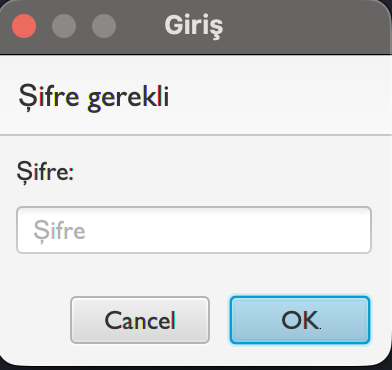
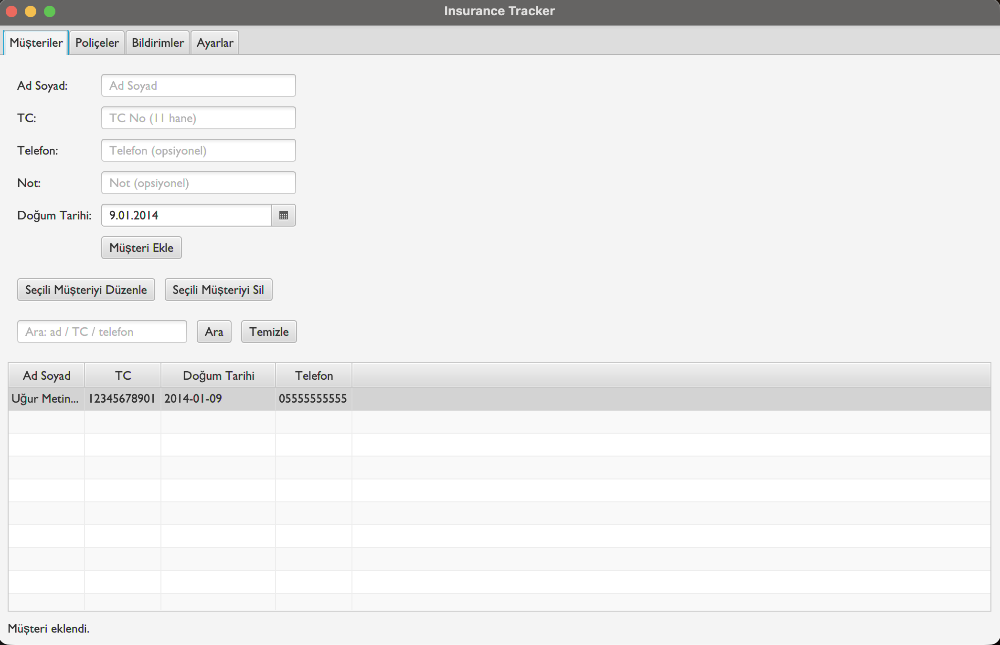
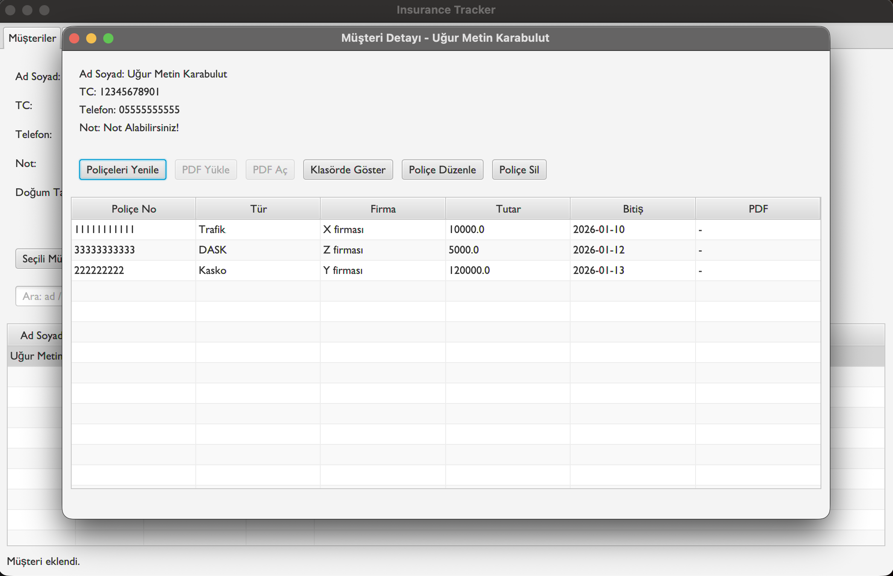
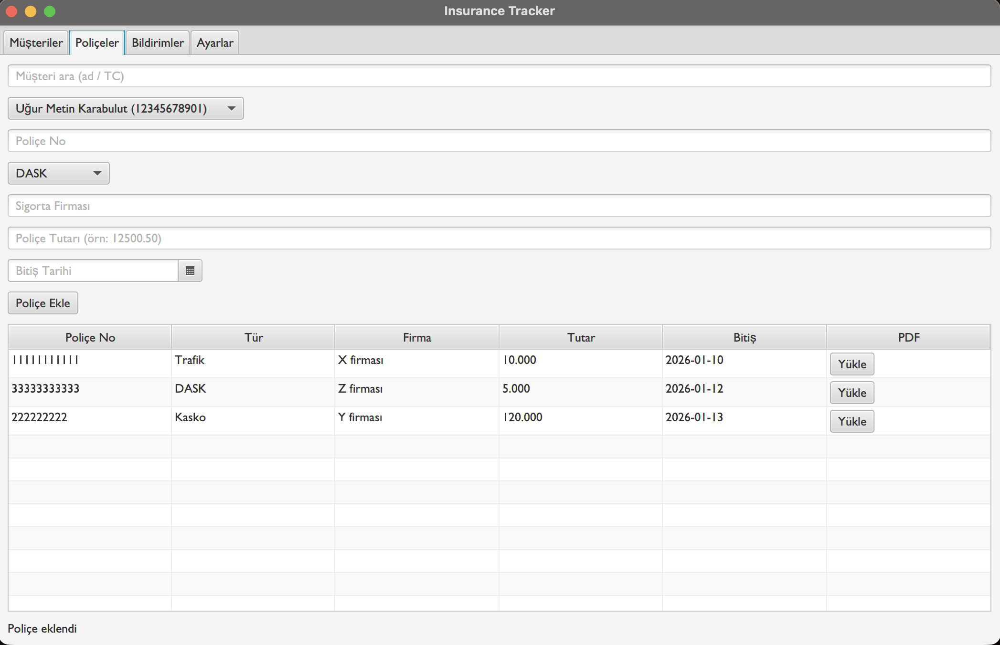
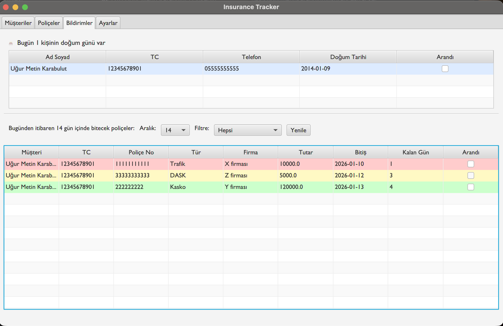
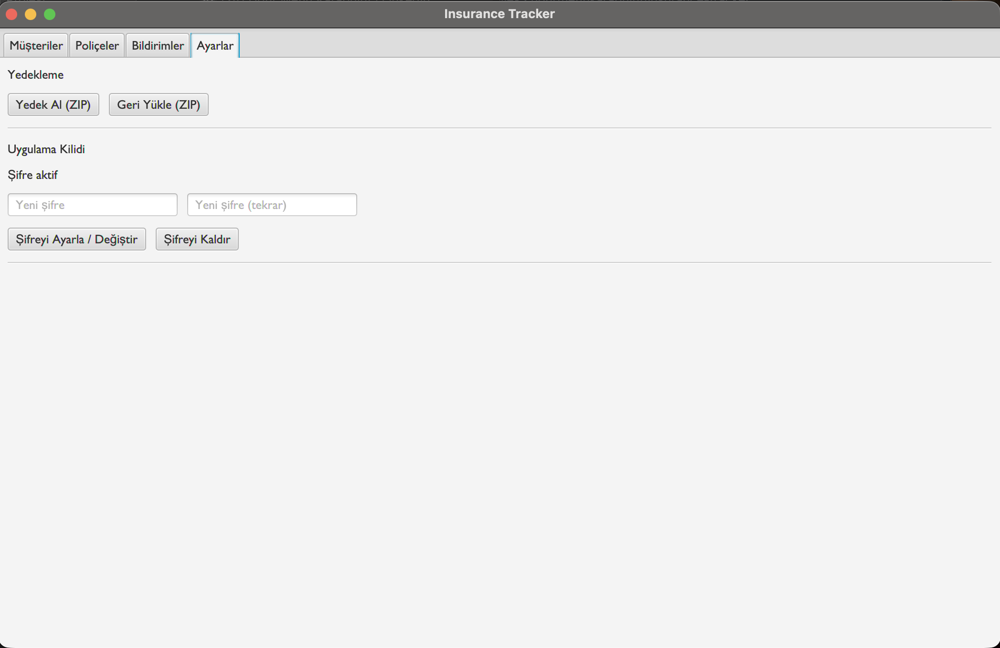

# insurance-tracker

JavaFX & SQLite based insurance agency tracking application (private source)  
JavaFX ve SQLite tabanlı, sigorta acenteleri için geliştirilmiş masaüstü takip uygulaması.

# Insurance Tracker (Private Source)

A desktop application developed for insurance agencies to manage customers and insurance policies.

⚠️ **Source code is private.**  
For access, collaboration, or demo requests, please contact me.

## 🚀 Features
- Customer & policy management
- Policy expiry notifications
- Customer birthday reminders
- PDF upload & management
- Password-protected access
- Local database (SQLite)

## 🛠️ Tech Stack
- Java
- JavaFX
- SQLite
- Gradle

## 📸 Screenshots
(Screenshots will be added)

## 🔒 License
This project is **not open-source** and is developed for **private and commercial use**.

The source code is proprietary and is shared only upon request and explicit
permission of the author.

## 👤 Developer
Uğur Metin Karabulut  
📧 ugurmetinkarabulut@gmail.com  
🔗 LinkedIn: https://www.linkedin.com/in/uğur-metin-karabulut-a16106340/

----------

## 📸 Screenshots

### 🔐 Login Screen

### 👤 Customer Management

### 📄 Customer Details & Policies

### 📑 Policy Management

### 🔔 Policy Expiry Notifications

### 🎂 Birthday Notifications

### ⚙️ Settings & Security

----------

# Insurance Tracker (Kaynak Kod Gizli)

Sigorta acenteleri için geliştirilmiş masaüstü müşteri ve poliçe takip uygulaması.

⚠️ **Kaynak kod paylaşılmamaktadır.**  
Kod erişimi, demo veya iş birliği için benimle iletişime geçebilirsiniz.

## 🚀 Özellikler
- Müşteri ve poliçe yönetimi
- Yaklaşan poliçe bitiş bildirimleri
- Doğum günü hatırlatmaları
- PDF yükleme ve görüntüleme
- Şifre korumalı erişim
- Yerel veritabanı (SQLite)

## 🛠️ Kullanılan Teknolojiler
- Java
- JavaFX
- SQLite
- Gradle

## 🔒 Lisans
Bu proje **özel kullanım ve ticari amaçla** geliştirilmiştir.  
Açık kaynak değildir ve kaynak kod yalnızca talep üzerine paylaşılmaktadır.

## 👤 Geliştirici
Uğur Metin Karabulut
📧 ugurmetinkarabulut@gmail.com  
🔗 LinkedIn: https://www.linkedin.com/in/uğur-metin-karabulut-a16106340/
