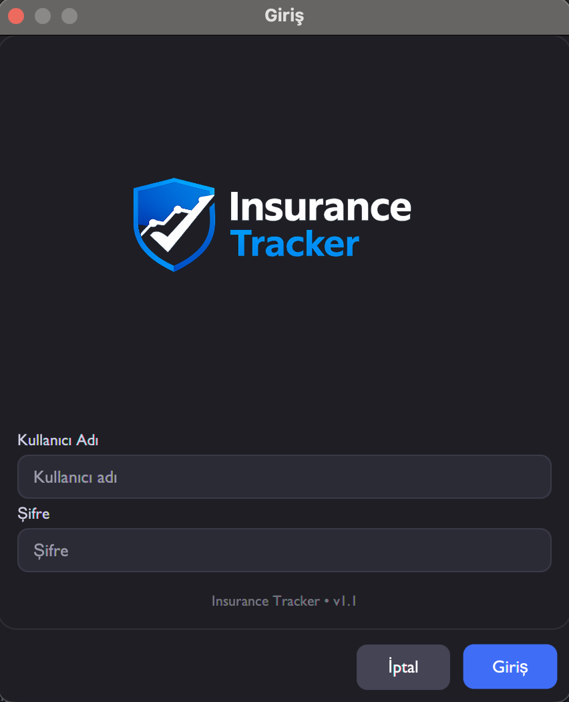
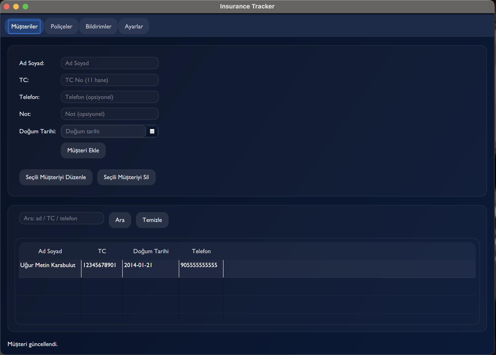
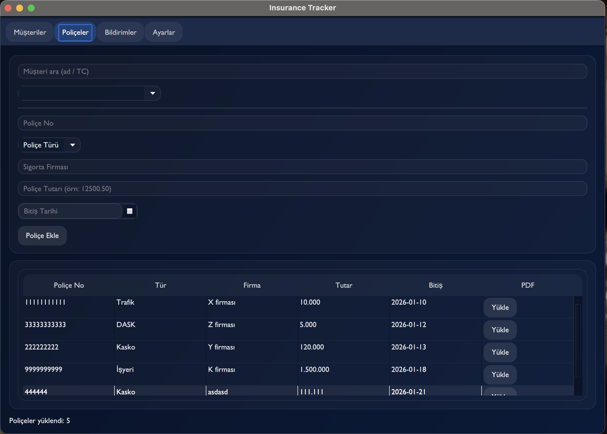
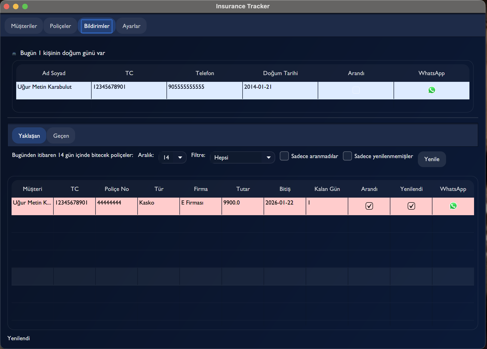
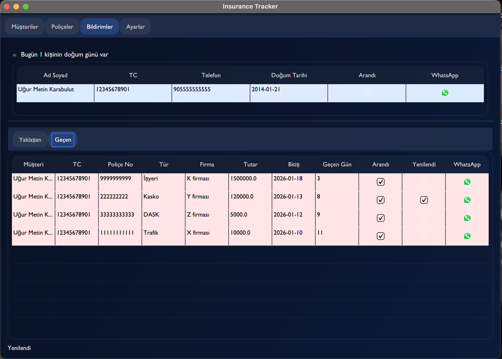
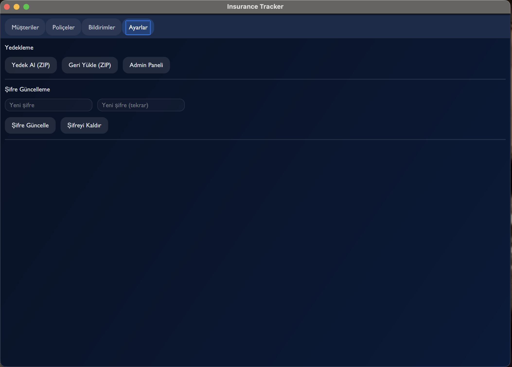
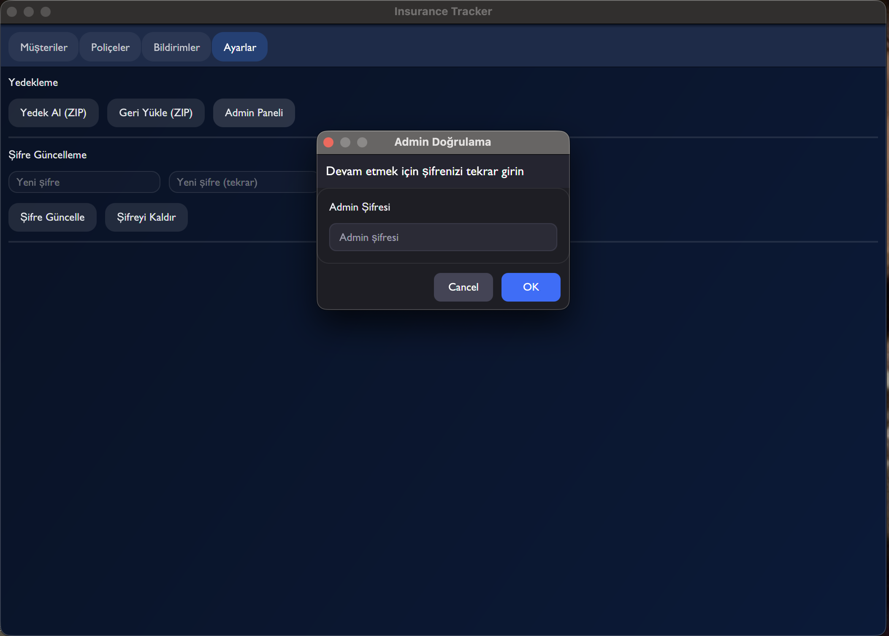
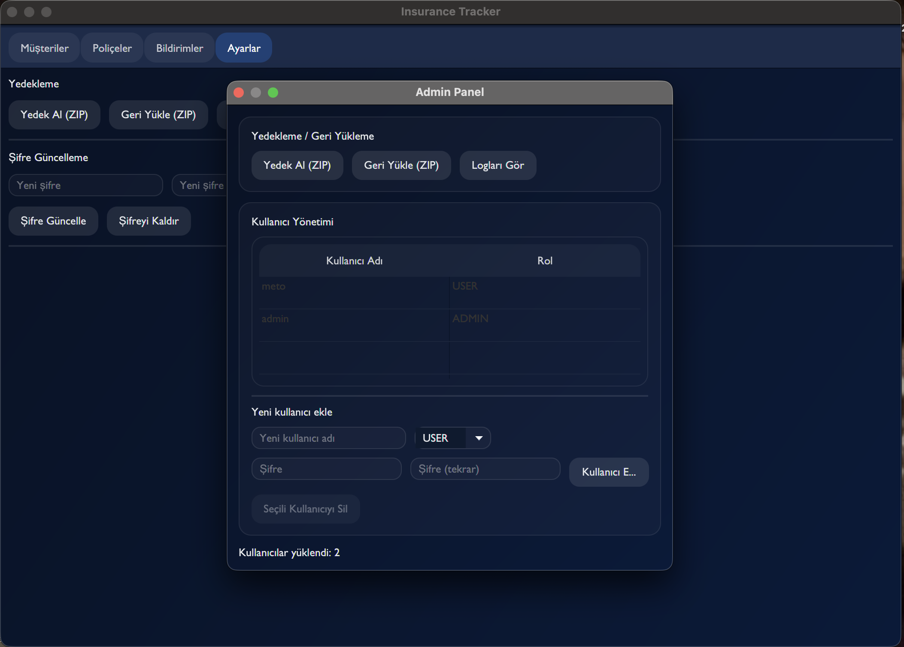
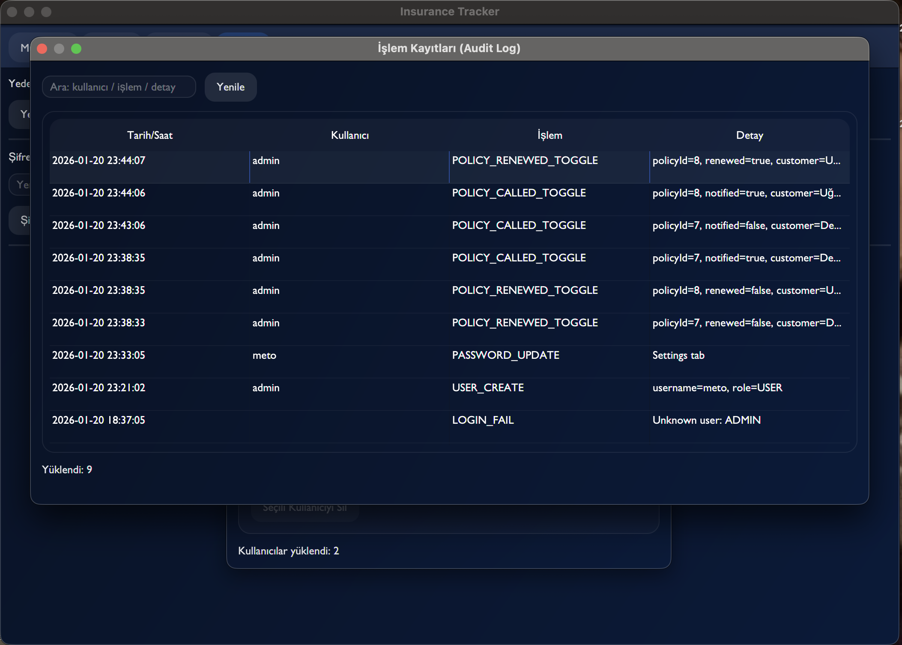
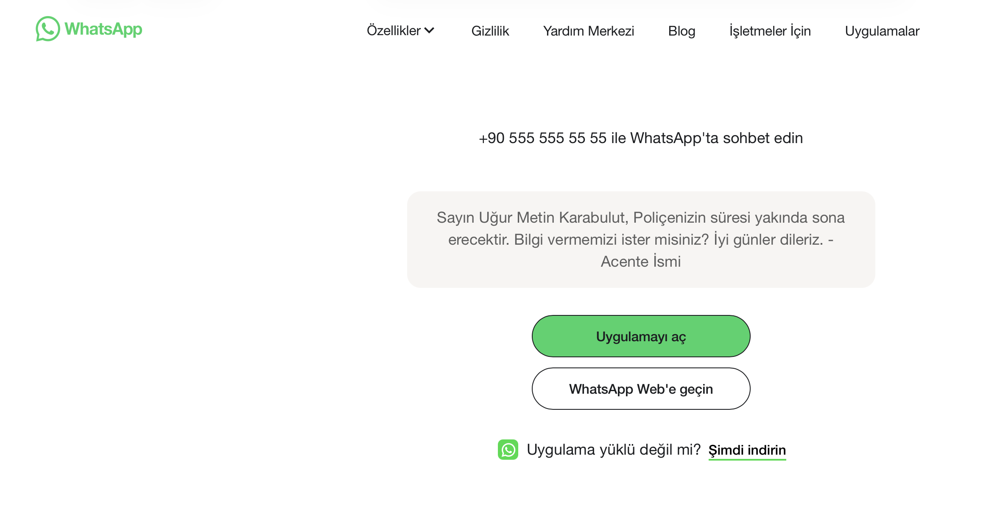

# Insurance Tracker (Private Source)

JavaFX & SQLite based desktop application developed for insurance agencies to manage
customers, insurance policies, and operational reminders.

⚠️ **Source code is private.**  
For access, collaboration, or demo requests, please contact me directly.

---

## 🚀 Features (v1.1)

- Customer & policy management  
- Policy expiry tracking with visual notifications  
- Customer birthday reminders  
- WhatsApp integration (one-click messaging with predefined templates)  
- PDF upload and policy document management  
- Admin panel with password verification  
- Role-based user management  
- Audit log for critical actions  
- Password-protected access  
- Local database (SQLite)  
- UI/UX and performance improvements  

---

## 🛠️ Tech Stack

- Java  
- JavaFX  
- SQLite  
- Gradle  

---

## 🔒 License

This project is **not open-source** and is developed for **private and commercial use**.

The source code is proprietary and shared only upon explicit permission of the author.

---

## 👤 Developer

**Uğur Metin Karabulut**  
📧 ugurmetinkarabulut@gmail.com  
🔗 LinkedIn: https://www.linkedin.com/in/uğur-metin-karabulut-a16106340/

---

## 📸 Screenshots

### 🔐 Login Screen

### 👤 Customer Management

### 📑 Policy Management

### 🔔 Notifications (Upcoming Policies)

### 🔔 Notifications (Expired Policies)

### 🎂 Birthday Reminders

### ⚙️ Settings

### 🔐 Admin Verification

### 🧑‍💼 Admin Panel (User Management)

### 🧾 Audit Log

### 💬 WhatsApp Integration

---

# Insurance Tracker (Kaynak Kod Gizli)

Sigorta acenteleri için geliştirilmiş, müşteri ve poliçe yönetimine odaklanan
JavaFX tabanlı masaüstü uygulama.

⚠️ **Kaynak kod paylaşılmamaktadır.**  
Demo, iş birliği veya erişim talepleri için benimle iletişime geçebilirsiniz.

---

## 🚀 Özellikler (v1.1)

- Müşteri ve poliçe yönetimi  
- Yaklaşan ve süresi dolan poliçeler için bildirim sistemi  
- Doğum günü hatırlatmaları  
- WhatsApp üzerinden tek tıkla müşteri mesajlaşma  
- PDF poliçe doküman yönetimi  
- Admin doğrulama ve kullanıcı yönetimi  
- Yetki bazlı erişim  
- Audit log (işlem kayıtları)  
- Şifre korumalı giriş  
- Yerel veritabanı (SQLite)  
- Arayüz ve performans iyileştirmeleri  

---

## 🛠️ Kullanılan Teknolojiler

- Java  
- JavaFX  
- SQLite  
- Gradle  

---

## 🔒 Lisans

Bu proje **özel ve ticari kullanım** amacıyla geliştirilmiştir.  
Açık kaynak değildir ve kaynak kod yalnızca talep üzerine paylaşılmaktadır.

---

## 👤 Geliştirici

**Uğur Metin Karabulut**  
📧 ugurmetinkarabulut@gmail.com  
🔗 LinkedIn: https://www.linkedin.com/in/uğur-metin-karabulut-a16106340/
